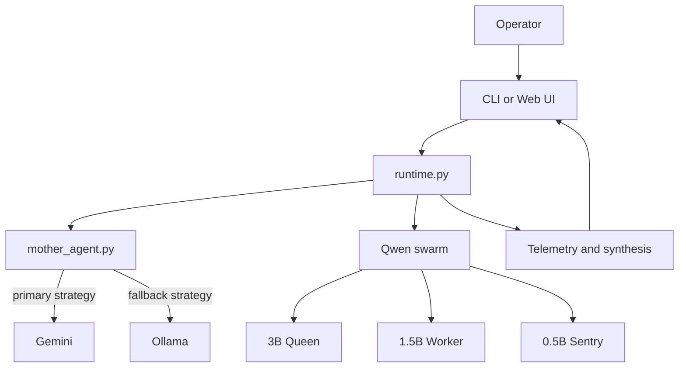

# Asmodeus

Experimental swarm runtime for hierarchical language-model orchestration.

Asmodeus is a research-oriented control stack that decomposes inference into a strategic layer, a tiered execution swarm, and an observable web dashboard. The design goal is not to imitate a single giant model, but to coordinate smaller specialists under explicit memory, routing, and recovery constraints.

## Abstract

The system treats language generation as a constrained control problem. A mother agent selects strategy, the runtime routes work through a Qwen-based swarm, and telemetry reports how much of the system was active during a turn. In practice, this means the codebase is organized around three questions:

1. What should be done.
2. Which specialist should do it.
3. How much memory and recovery budget the turn consumed.

Gemini is the primary strategic model. Ollama is retained only as a fallback when Gemini credentials are unavailable.

## System Diagram



## Runtime Surfaces

| Surface | Entry point | Purpose |
| --- | --- | --- |
| Windows launcher | `asmodeous.ps1` | Elevation-friendly bootstrap for the local workstation path |
| CLI swarm shell | `python cli.py` | Interactive terminal runtime for direct queries and experiments |
| Web dashboard | `python asmodeus/web_ui.py` | FastAPI + WebSocket interface at `http://127.0.0.1:8000` |
| Batch runner | `launcher/batch/` | Staged Windows launch path used by the local orchestration scripts |

## Architecture

### Strategic Plane

`asmodeus/mother_agent.py` handles provider selection and strategic synthesis. The intended policy is:

- Gemini first.
- Ollama only when Gemini API credentials are absent.
- No dependency on GitHub login for model strategy.

### Control Plane

`asmodeus/runtime.py`, `asmodeus/router.py`, `asmodeus/registry.py`, and `asmodeus/cluster_topology.py` form the coordination layer. They decide how many specialists should participate, how tasks are assigned, and when the runtime should reduce or recover active state.

### Execution Plane

`asmodeus/true_inference.py`, `asmodeus/downloader.py`, `asmodeus/hybrid_adapter.py`, and the supporting model utilities implement tiered inference, model acquisition, and memory placement. The default swarm roles are:

- Queen: `Qwen/Qwen2.5-3B-Instruct`
- Worker: `Qwen/Qwen2.5-1.5B-Instruct`
- Sentry: `Qwen/Qwen2.5-0.5B-Instruct`

These roles can be overridden from the CLI or launcher scripts when the hardware profile requires it.

### Observability Plane

`asmodeus/web_ui.py` serves a live dashboard backed by WebSockets. It emits the response text together with runtime diagnostics such as coherence, active parameter count, p-adic stability, recovery events, and specialist count.

## Quickstart

### 1. Create and activate an environment

```powershell
python -m venv .venv
.venv\Scripts\Activate.ps1
```

On POSIX shells, use `source .venv/bin/activate` instead.

### 2. Install dependencies

```powershell
pip install -r requirements.txt
```

The Python packaging metadata is declared in `pyproject.toml`, and the native build backend uses `maturin` for the Rust kernel under `lambda-azure-engine/rust-kernel`.

### 3. Configure the strategic provider

Set one of the following environment variables before starting the runtime:

- `GEMINI_API_KEY`
- `GOOGLE_API_KEY`

If neither is present, the mother-agent layer falls back to Ollama on the local machine.

### 4. Launch the CLI

```powershell
python cli.py --mother-agent gemini
```

Useful flags include:

- `--queen-id`, `--worker-id`, `--sentry-id`
- `--hybrid-memory`
- `--require-gpu`
- `--local-model-only`
- `--idle-autonomy`
- `--train-english-slm`

### 5. Launch the web dashboard

```powershell
python asmodeus\web_ui.py
```

The browser UI connects to `/ws` and streams both output text and live telemetry.

## Configuration

The runtime is intentionally explicit. The most important controls are:

| Signal | Effect |
| --- | --- |
| `ASMODEUS_MOTHER_AGENT` | Default provider for the web UI |
| `GEMINI_API_KEY` / `GOOGLE_API_KEY` | Enables Gemini as the primary strategic model |
| `--queen-id`, `--worker-id`, `--sentry-id` | Override the swarm model IDs |
| `--k` | Number of active specialists considered per query |
| `--budget` | Active parameter budget for the control plane |
| `--vram-limit` | Hard VRAM limit used by wavefront paging |
| `--hybrid-memory` | Allow mixed VRAM + RAM placement |
| `--local-model-only` | Prevent downloads and use local files only |
| `--idle-autonomy` | Enable WSL-backed idle self-study workflows |
| `--train-english-slm` | Train the English SLM from `docs/english_slm_corpus.txt` |

## Telemetry

The web UI and runtime expose the following observable signals during a turn:

| Field | Meaning |
| --- | --- |
| `coherence` | Aggregate quality signal for the generated response |
| `active_params` | Estimated live parameter footprint |
| `p_adic` | Internal stability diagnostic used by the swarm runtime |
| `recovery_events` | Count of repair or fallback events during the turn |
| `specialist_count` | Number of active specialists that participated |

These diagnostics are useful for comparing runs, but they are still heuristics rather than formal proof of correctness.

## Artifact Policy

The repository intentionally keeps generated artifacts out of version control. Local checkpoints, downloaded model files, cache directories, runtime logs, and ephemeral databases are treated as working state rather than source.

Typical local outputs include:

- `.offload_cache/`
- `.agents/`
- `logs/`
- `models/`
- `experts/`
- `experts_test/`
- `expert_checkpoints/*.npz`
- `clara_context.db*`

This keeps the history small, reproducible, and focused on source code and documentation.

## Repository Map

- `asmodeus/runtime.py` - core orchestration and execution flow.
- `asmodeus/true_inference.py` - tiered inference engine and VRAM-aware loading.
- `asmodeus/mother_agent.py` - Gemini/Ollama strategic provider logic.
- `asmodeus/web_ui.py` - live WebSocket dashboard and HTTP surface.
- `launcher/batch/` - Windows batch launch stages.
- `asmodeus/wsl_docker_launcher.py` - WSL and Docker bootstrap helper.
- `core_hardware/` - lower-level hardware integration helpers.
- `docs/` - deeper design and implementation notes.

## Further Reading

- [docs/OVERVIEW.md](docs/OVERVIEW.md)
- [docs/SYSTEM_ARCHITECTURE.md](docs/SYSTEM_ARCHITECTURE.md)
- [docs/RUNTIME_INTEGRATION_DOCTRINE.md](docs/RUNTIME_INTEGRATION_DOCTRINE.md)
- [docs/SUPREME_DOCTRINE.md](docs/SUPREME_DOCTRINE.md)
- [docs/TOPOLOGY_100M_TO_10B.md](docs/TOPOLOGY_100M_TO_10B.md)
- [docs/IMPLEMENTATION_PLAN.md](docs/IMPLEMENTATION_PLAN.md)

## Status

The current codebase is aligned around a Gemini-first control layer, a smaller Qwen swarm for execution, and a live frontend for telemetry and operator interaction. Containerization scaffolding already exists in the repository and can be unified after this documentation and hygiene pass.
